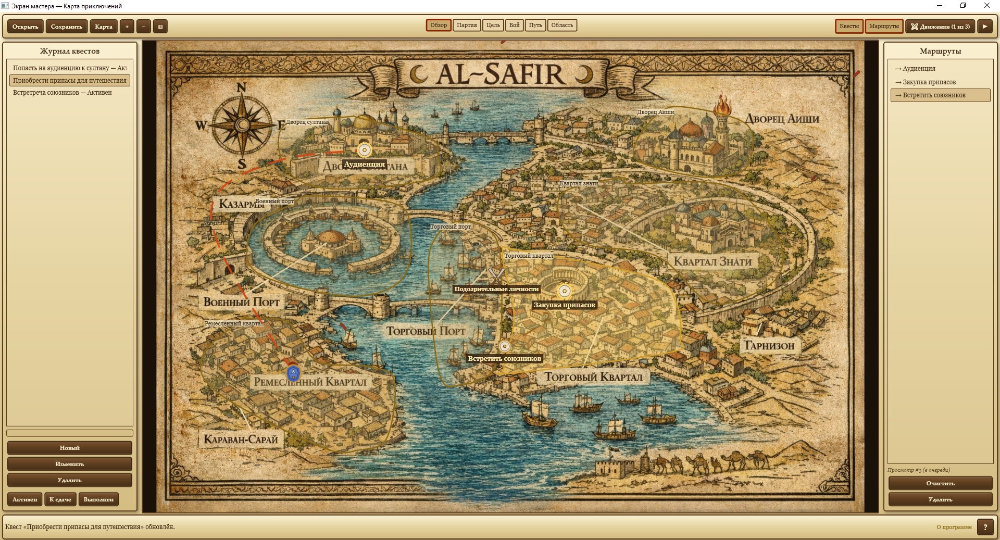
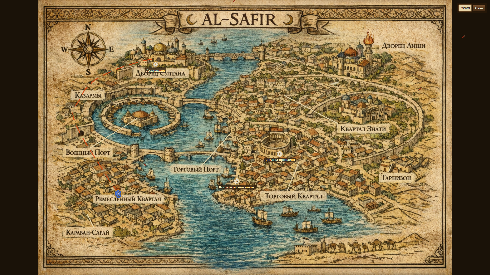
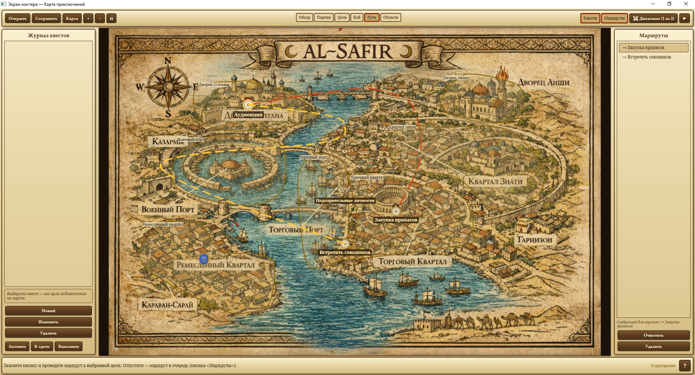
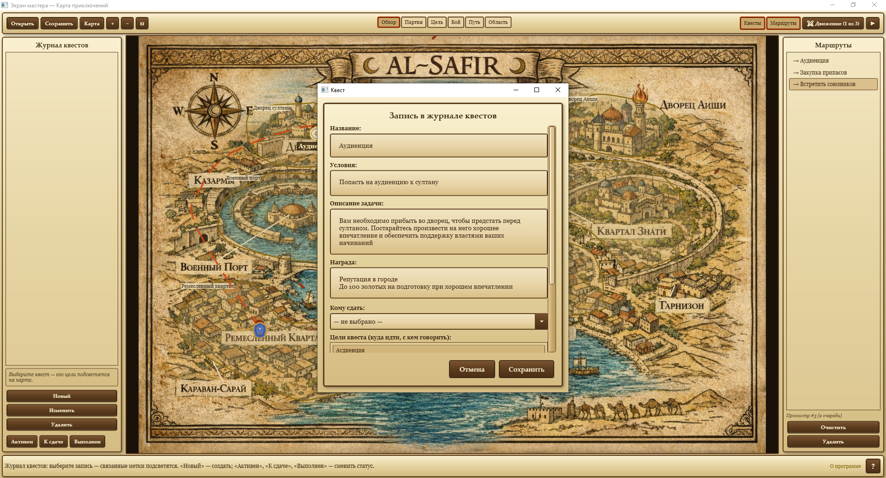
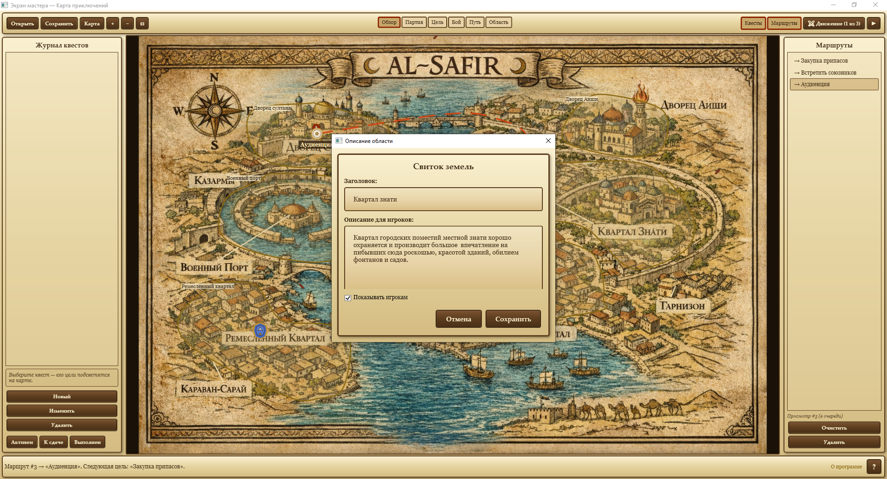

# DnDMapHelper

**DnDMapHelper** — бесплатное настольное приложение для мастеров настольных ролевых игр, проводящих **очные партии**.

В отличие от виртуальных игровых столов (VTT), DnDMapHelper создан не для игры через интернет, а для помощи мастеру в очных играх. Программа позволяет показывать карту игрокам на отдельном экране или телевизоре, постепенно раскрывать мир приключения и хранить всю служебную информацию отдельно от игроков.

**Без регистрации. Без интернета. Без сложной настройки VTT. Просто запускайте игру.**

# Зачем нужен DnDMapHelper?

Во время очной игры мастеру часто приходится одновременно использовать:

* ноутбук с заметками;
* изображения карт;
* телевизор или второй монитор для игроков;
* список квестов;
* описания локаций;
* записи о встречах и событиях.

DnDMapHelper объединяет всё это в одном приложении и позволяет сосредоточиться на проведении игры, а не на постоянном переключении между окнами или перебирании бесконечного раздаточного материала.

# Основные возможности

## 🗺 Карта приключения

Создавайте интерактивные карты своих приключений.

Можно:

* загружать собственные изображения карт;
* размещать точки интереса;
* связывать их маршрутами;
* создавать области и их описания;
* быстро перемещаться между сценами.

## 🚶 Маршруты путешествий

Подготовьте путь заранее и проводите игроков по карте постепенно.

Подходит для:

* путешествий между городами;
* исследования новых территорий;
* прохождения подземелий;
* морских приключений и путешествий.
* 

## 📜 Области и описания

Для каждой области можно подготовить собственное описание, которое откроется именно тогда, когда это понадобится.

Это удобно для:

* описаний комнат;
* сюжетных вставок;
* найденных объектов;
* секретов;
* повествовательных сцен.

## ⚔ Встречи

Привязывайте встречи непосредственно к карте.

Например:

* боевые столкновения (например, нападение разбойников);
* ловушки;
* случайные события;
* сюжетные встречи.

## 📖 Квесты

Храните информацию о заданиях прямо внутри проекта.

Мастер всегда имеет быстрый доступ к необходимой информации, а игроки видят только игровой экран.

## 🖥 Режим двух экранов

### Экран мастера

Доступны:

* полная карта;
* все скрытые заметки;
* встречи;
* описания;
* квесты;
* инструменты редактирования.

### Экран игроков

Игроки видят только:

* карту;
* текущий маршрут;
* уже открытые области.

Никаких спойлеров и случайно открытых заметок.

# Скриншоты

## Главное окно

## Экран игроков

## Маршруты

## Квесты

## Описание области

)

# Быстрый старт

1. Скачайте последнюю версию приложения в разделе **Releases**.
2. Создайте новый проект.
3. Загрузите карту.
4. Добавьте точки интереса.
5. Соедините их маршрутами.
6. Настройте области и встречи.
7. Откройте экран игроков.
8. Начинайте приключение.

# Для каких систем подходит?

DnDMapHelper не привязан к конкретной системе.

Приложение одинаково хорошо подходит для:

* Dungeons & Dragons;
* Pathfinder;
* Call of Cthulhu;
* Shadowdark;
* Dragonbane;
* Forbidden Lands;
* авторских настольных RPG.

# Чем отличается от виртуальных игровых столов?

| DnDMapHelper                               | VTT (Foundry, Roll20 и др.)          |
| ------------------------------------------ | ------------------------------------ |
| Создан для очных игр                       | Основной сценарий — онлайн-игра      |
| Быстро запускается                         | Требует более сложной подготовки     |
| Работает полностью офлайн                  | Часто использует сетевые функции     |
| Прост в освоении                           | Большое количество настроек          |
| Сосредоточен на путешествии и исследовании | Основной акцент на автоматизации боя |

DnDMapHelper **не пытается заменить Foundry или Roll20**.

Это лёгкий инструмент для мастеров, которым нужен удобный способ проводить очные игры с использованием второго экрана.

# Формат проекта

Все данные сохраняются в собственном формате **.dndmap**.

Проект включает:

* карты;
* маршруты;
* области;
* встречи;
* квесты;
* заметки мастера.

# Обратная связь

Если вы нашли ошибку или хотите предложить новую возможность — создайте Issue на GitHub или напишите на почту:

**[dndtools.lebedev@proton.me](mailto:dndtools.lebedev@proton.me)**

Любые идеи и предложения приветствуются.

# Лицензия

Проект распространяется по лицензии **MIT**.

Разработчик: **Василий Лебедев**
